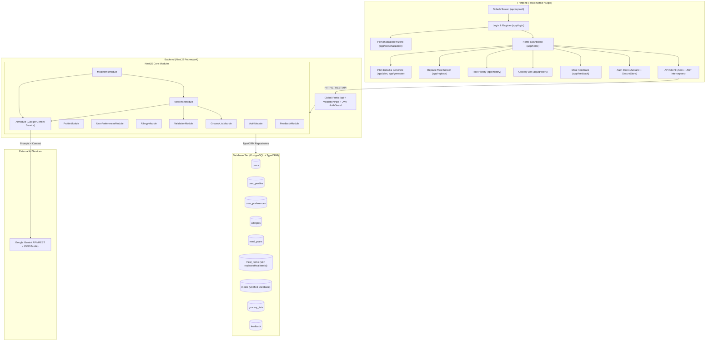

# 🥗 Nutrio AI — Intelligent Personalized Nutrition & Meal Planning Platform

Nutrio AI is a full-stack, AI-powered personalized nutrition and meal-planning mobile application designed to provide culturally adaptive, nutritionally verified, and budget-friendly diet plans. Tailored especially for including Sri Lankan cuisine, Nutrio AI creates structured multi-day meal plans, provides AI-driven meal replacement alternatives, automates categorized grocery lists, enforces allergy and dietary safety constraints, and continuously learns user preferences through feedback.

---

## 🌟 Key Features

### 1. 🚀 Splash & Onboarding Flow

- **Branded Splash Entry**: High-fidelity landing screen with visual branding, feature badges (_Goal-based plans_, _Budget friendly_, _Made for you_), and smooth navigation into Authentication.
- **Guided Personalization Onboarding**: Multi-step intake wizard capturing physical attributes (Age/DOB, Biological Sex, Height, Weight, Activity Level, Fitness Goals) and dietary preferences (Diet Type, Cuisines, Excluded Ingredients, Disliked Foods, Allergens, Daily Budget in LKR, Meals per Day).

### 2. 🤖 AI-Powered Adaptive Meal Plan Generation

- Generates structured multi-day diet plans using **Google Gemini 3.5 Flash** models with structured JSON schemas.
- Contextualizes recipes with regional and whole-food ingredients (e.g., Red Rice, Dhal Curry, Pol Roti, String Hoppers, Fish Ambul Thiyal, Grilled Chicken, Steamed Greens).
- Automatically calculates BMR / TDEE calorie and macro targets (Protein, Carbs, Fat) tailored to weight loss, muscle gain, or maintenance.

### 3. 🔄 Dynamic AI Meal Replacement System

- **Real-Time AI Alternatives (`GET /api/meal-items/:id/alternatives`)**: Generates 3 personalized replacement dishes using Gemini AI, strictly honoring the user's calorie budget, allergies, and historical feedback.
- **Database-Linked Swapping (`POST /api/meal-items/:id/replace`)**: Archives the previous item (`status = 'replaced'`), records the replacement with `replacesMealItemId`, and automatically recalculates parent meal plan calories, macros, and estimated cost totals.
- **Dedicated Replacement Screen (`replace.tsx`)**: Displays the current meal with "Why replace?" insights, tag pills (_High Protein_, _Gluten Free_, _Vegetarian_), and 1-tap instant dashboard synchronization.

### 4. 📊 Interactive Dashboard & Meal Details Modal

- Dynamic circular calorie gauge and real-time remaining macro trackers.
- Meal cards for Breakfast, Lunch, Dinner, and Snacks with completion toggle checkmarks.
- **Recipe & Meal Details Modal**: Complete ingredient lists with quantities, preparation times, step-by-step cooking instructions, and direct triggers for **Replace Meal** and **Give Feedback**.

### 5. 📜 Plan History & Management (`history.tsx`)

- View and search past and active meal plans (`GET /api/meal-plans`).
- Filter by **All Plans**, **Active**, **Completed**, and **Saved**.
- Quality Score ratings (0–100%), calorie and cost summaries, and 1-tap plan view.

### 6. 🛒 Smart Categorized Grocery List (`grocery.tsx`)

- Aggregates ingredients across all scheduled meals in the active plan (`GET /api/grocery-list/plan/:id`).
- Intelligently categorizes items into 5 nutritional groups:
  1. **Carbohydrates** 🍚 (Rice, Bread, Roti, Flour, Oats, Noodles, Pittu, Potatoes, etc.)
  2. **Proteins** 🍗 (Chicken, Fish, Eggs, Tofu, Dhal, Lentils, Chickpeas, Dairy, etc.)
  3. **Vegetables** 🥬 (Greens, Carrots, Cabbage, Leeks, Tomatoes, Gotukola, Capsicum, etc.)
  4. **Fruits** 🍎 (Bananas, Papaya, Mangoes, Apples, Avocados, Lime, etc.)
  5. **Other** 🧂 (Cooking Oils, Spices, Seasonings, Sugar, Goraka, Condiments)
- Filter by _All Items_, _To Buy_, and _Purchased_, with interactive item checkboxes and "Mark All as Purchased".

### 7. 💬 Continuous Personalization & Feedback Loop

- Rate meals with Thumbs Up/Down, 1–5 Star ratings, custom reviews, and reason tags (_Too spicy_, _Too expensive_, _Hard to prepare_, _Unavailable ingredients_, _Portion too small/large_).
- Feedback history is stored and passed into subsequent AI generation prompts to eliminate disliked meals and reinforce favorite recipes.

---

## 🏗️ System Architecture



---

## 💻 Technology Stack

### Backend

- **Framework**: NestJS (Node.js)
- **Language**: TypeScript
- **Database & ORM**: PostgreSQL with TypeORM
- **Authentication**: Passport.js with JWT Strategy & `bcrypt` password hashing
- **Validation**: `class-validator` and `class-transformer`
- **AI Integration**: Google Gemini API (`@nestjs/config`, `fetch` with structured JSON responses)

### Frontend

- **Framework**: React Native with Expo (SDK 54)
- **Routing**: Expo Router (File-based navigation)
- **Styling**: Vanilla React Native StyleSheet + NativeWind (TailwindCSS)
- **State Management**: Zustand
- **Networking**: Axios with automatic JWT interceptors
- **Icons**: `@expo/vector-icons` (Ionicons, Feather, MaterialCommunityIcons)
- **Storage**: `expo-secure-store`

---

## 🔌 API Reference

All backend endpoints are prefixed with `/api`. Protected routes require a Bearer token in the `Authorization` header (`Authorization: Bearer <JWT_TOKEN>`).

### 🔐 Authentication (`/api/auth`)

| Method | Endpoint             | Description                                            | Auth |
| :----- | :------------------- | :----------------------------------------------------- | :--: |
| `POST` | `/api/auth/register` | Register a new user account                            |  No  |
| `POST` | `/api/auth/login`    | Authenticate user and return JWT access token          |  No  |
| `GET`  | `/api/auth/me`       | Fetch authenticated user details and onboarding status | Yes  |

### 👤 Profile & Preferences (`/api/profile`, `/api/preferences`, `/api/allergies`)

| Method   | Endpoint             | Description                                                        | Auth |
| :------- | :------------------- | :----------------------------------------------------------------- | :--: |
| `GET`    | `/api/profile`       | Retrieve physical attributes, DOB, and fitness goal                | Yes  |
| `PUT`    | `/api/profile`       | Create/update profile (triggers BMR & calorie target calculations) | Yes  |
| `GET`    | `/api/preferences`   | Retrieve dietary preferences, cuisines, and budget                 | Yes  |
| `PUT`    | `/api/preferences`   | Update meal frequency, excluded ingredients, daily budget          | Yes  |
| `GET`    | `/api/allergies`     | List user registered allergens                                     | Yes  |
| `POST`   | `/api/allergies`     | Add new allergen                                                   | Yes  |
| `DELETE` | `/api/allergies/:id` | Remove registered allergen                                         | Yes  |

### 🍽️ Meal Plans (`/api/meal-plans`)

| Method  | Endpoint                     | Description                                                     | Auth |
| :------ | :--------------------------- | :-------------------------------------------------------------- | :--: |
| `POST`  | `/api/meal-plans/generate`   | Generate full multi-day AI meal plan (Gemini + Validation)      | Yes  |
| `GET`   | `/api/meal-plans`            | List user's historical and active meal plans                    | Yes  |
| `GET`   | `/api/meal-plans/latest`     | Fetch the currently active meal plan                            | Yes  |
| `GET`   | `/api/meal-plans/:id`        | Fetch full meal plan details with active items and grocery list | Yes  |
| `PATCH` | `/api/meal-plans/:id/status` | Update plan status (`active`, `completed`, `archived`)          | Yes  |

### 🍲 Meal Items & AI Replacement (`/api/meal-items`)

| Method  | Endpoint                           | Description                                                                                      | Auth |
| :------ | :--------------------------------- | :----------------------------------------------------------------------------------------------- | :--: |
| `GET`   | `/api/meal-items/:id/alternatives` | Generate 3 tailored AI replacement meals based on user profile, budget, and feedback             | Yes  |
| `POST`  | `/api/meal-items/:id/replace`      | Archive original item, create replacement with `replacesMealItemId`, and recalculate plan totals | Yes  |
| `PATCH` | `/api/meal-items/:id/toggle`       | Toggle meal status between `completed` and `scheduled`                                           | Yes  |
| `PATCH` | `/api/meal-items/:id/status`       | Update specific item status and consumed servings                                                | Yes  |
| `GET`   | `/api/meal-items/:id`              | Fetch single meal item detail with relations                                                     | Yes  |

### 🛒 Grocery Lists (`/api/grocery-list`)

| Method  | Endpoint                                      | Description                                    | Auth |
| :------ | :-------------------------------------------- | :--------------------------------------------- | :--: |
| `GET`   | `/api/grocery-list/plan/:planId`              | Fetch categorized grocery list for a meal plan | Yes  |
| `PATCH` | `/api/grocery-list/plan/:planId/items/:index` | Toggle purchased status of a grocery item      | Yes  |

### ⭐ Feedback & Reviews (`/api/feedback`)

| Method   | Endpoint            | Description                                                      | Auth |
| :------- | :------------------ | :--------------------------------------------------------------- | :--: |
| `POST`   | `/api/feedback`     | Submit meal rating, thumbs up/down, reason tags, and review text | Yes  |
| `GET`    | `/api/feedback`     | List user submitted feedback history                             | Yes  |
| `GET`    | `/api/feedback/:id` | Fetch specific feedback record                                   | Yes  |
| `DELETE` | `/api/feedback/:id` | Delete feedback record                                           | Yes  |

---

## 🚀 Setup & Installation

### Prerequisites

- **Node.js**: `v18.x` or `v20.x`
- **npm**
- **PostgreSQL Database** (Local instance or Cloud e.g., Supabase, Neon, AWS RDS)
- **Google Gemini API Key** (from [Google AI Studio](https://aistudio.google.com/))
- **Expo Go App** on mobile or an iOS/Android Simulator

---

### 1. Backend Setup

1. **Navigate to the backend directory**:

   ```bash
   cd backend
   npm install
   ```

2. **Configure Environment Variables**:
   Create a `.env` file in `backend/`:

   ```env
   PORT=3000
   DATABASE_URL=postgresql://<username>:<password>@<host>:<port>/<database>?sslmode=require
   JWT_SECRET=your-super-secret-jwt-key
   GEMINI_API_KEY=your-google-gemini-api-key
   GEMINI_MODEL=gemini-3.5-flash
   ```

3. **Start the Backend Server**:
   ```bash
   # Development mode with hot-reload
   npm run start:dev
   ```
   _The backend will be available at `http://localhost:3000/api`._

---

### 2. Frontend Setup

1. **Navigate to the frontend directory**:

   ```bash
   cd frontend
   npm install
   ```

2. **Configure Environment Variables**:
   Create a `.env` file in `frontend/`:

   ```env
   EXPO_PUBLIC_API_URL=http://<YOUR_LOCAL_IP>:3000/api
   ```

   _(Replace `<YOUR_LOCAL_IP>` with your computer's LAN IP address, e.g., `http://192.168.1.100:3000/api`, so mobile devices running Expo Go can communicate with the server)._

3. **Start the Expo App**:

   ```bash
   npx expo start -c
   ```

4. **Launch on Device / Simulator**:
   - **Android**: Scan the terminal QR code in the **Expo Go** app or press `a`.
   - **iOS**: Scan the QR code using the iOS Camera app or press `i`.
   - **Web**: Press `w` to run in the web browser.

---

## 🛡️ Verification & Multi-Layer Safety Engine

Every generated meal plan passes through automated multi-point verification:

```text
[Gemini AI Response]
      │
      ▼
[Schema & Parsing Guard]
      │
      ▼
[Allergen & Exclusion Filter] ──▶ (Strict string & token matching)
      │
      ▼
[Diet Compliance Check] ────────▶ (Enforces vegetarian/vegan boundaries)
      │
      ▼
[Calorie & Macro Matching] ─────▶ (Validates daily target within ±10% window)
      │
      ▼
[Budget Tracking Engine] ───────▶ (Validates cost in LKR against daily budget)
      │
      ▼
[Composite Quality Score] ──────▶ (Scores 0–100% based on nutrition, safety & variety)
```

---
