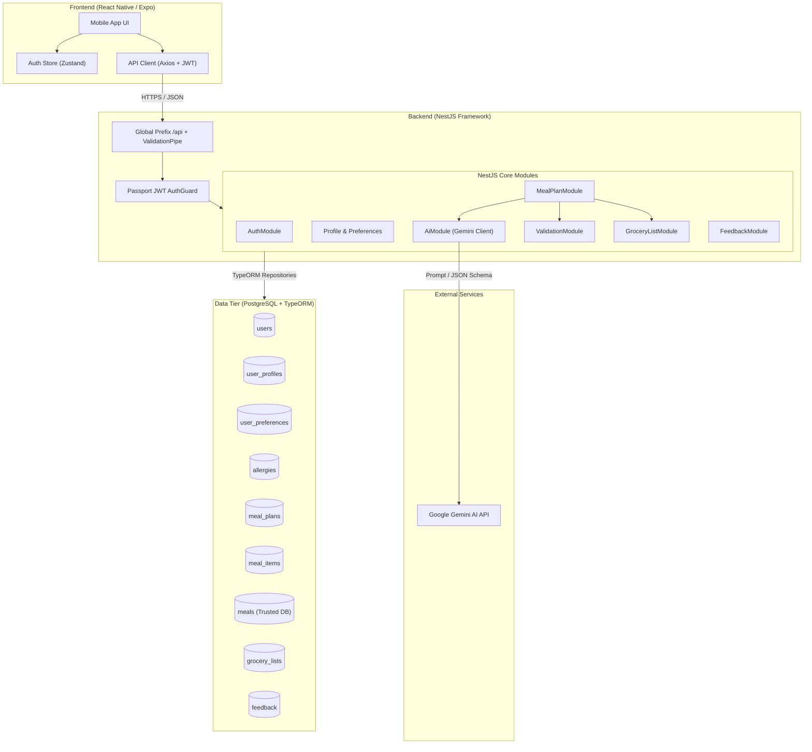

# 🥗 Nutrio AI — Intelligent Personalized Nutrition & Meal Planning Platform

Nutrio AI is an AI-powered personalized nutrition and meal-planning mobile application designed to provide culturally adaptive, nutritionally verified, and budget-friendly meal plans. Specializing in Sri Lankan culinary profiles, Nutrio AI crafts comprehensive multi-day diet plans, automates consolidated grocery lists, validates ingredient safety against allergies, and continuously learns user preferences through feedback.

---

## 🌟 Core Features

### 1. 🤖 AI-Powered Adaptive Meal Generation

- Generates multi-day structured meal plans using **Google Gemini 2.5/3.5 Flash** models.
- Adapts to user goals: **Weight Loss**, **Muscle Gain**, **Maintenance**, or **General Wellness**.
- Contextualizes recipes with authentic regional ingredients (e.g., Red Rice, Dhal, Pol Sambol, String Hoppers, Fish Ambul Thiyal).

### 2. 🛡️ Multi-Layer Constraint & Safety Validation Engine

- **Allergy & Intolerance Guard**: Inspects every meal against strict allergen profiles (e.g., Peanuts, Dairy, Shellfish, Gluten, Soy).
- **Macro & Calorie Balancing**: Calculates BMR/TDEE targets from age, gender, height, weight, and activity level.
- **Budget Compliance**: Tracks daily budget in LKR to keep plans economical.
- **Diversity & Prep Time Checks**: Prevents repetitive meals and honors maximum cooking time preferences.

### 3. 📊 Daily Tracking Dashboard

- Dynamic circular progress rings and macro breakdown bars (Calories, Protein, Carbs, Fats).
- Interactive meal check-offs to mark breakfasts, lunches, and dinners completed.
- Daily budget utilization tracking.

### 4. 🛒 Automated Consolidated Grocery List

- Aggregates ingredients across all scheduled meals in the active plan.
- Categorizes items into **Fresh Produce**, **Grains & Bakery**, **Proteins & Meat**, **Spices & Condiments**, and **Dairy**.
- Interactive checkbox list to track in-store shopping with estimated pricing.

### 5. 💬 Continuous Personalization & Feedback Loop

- Rate meals with thumbs up/down, 1–5 star ratings, reason tags (_Too spicy_, _Expensive_, _Hard to prepare_, _Unavailable ingredients_), and custom reviews.
- Persists feedback to refine future AI meal generations.

### 6. 🎨 Modern Mobile Interface

- Built with **React Native (Expo)**, **NativeWind**, and custom glassmorphism / soft-green pastel palettes.
- Smooth transitions, bottom sheet drawers, and optimized gesture handling.

---

## 🏗️ System Architecture



---

## 💻 Technology Stack

### Backend

- **Framework**: NestJS
- **Language**: TypeScript
- **Database & ORM**: PostgreSQL with TypeORM
- **Authentication**: Passport.js with JWT Strategy & `bcrypt` password hashing
- **Validation**: `class-validator` and `class-transformer`
- **AI Integration**: Google Gemini API via REST (`generateContent` with JSON mode)

### Frontend

- **Framework**: React Native with Expo
- **Routing**: Expo Router (File-based navigation)
- **Styling**: NativeWind (TailwindCSS v3 for React Native) & Custom StyleSheet
- **State Management**: Zustand
- **Networking**: Axios with automatic JWT interceptors
- **Icons**: @expo/vector-icons (Ionicons, Feather, MaterialCommunityIcons)

---

## 🔌 API Reference

All backend endpoints are prefixed with `/api`. Protected routes require a Bearer token in the `Authorization` header.

### 🔐 Authentication (`/api/auth`)

| Method | Endpoint             | Description                                              | Auth |
| :----- | :------------------- | :------------------------------------------------------- | :--: |
| `POST` | `/api/auth/register` | Register new user account with email, name, and password |  No  |
| `POST` | `/api/auth/login`    | Authenticate user and receive JWT access token           |  No  |
| `GET`  | `/api/auth/me`       | Fetch authenticated user profile & onboarding status     | Yes  |

### 👤 Profile & Personalization (`/api/profile`, `/api/preferences`, `/api/allergies`)

| Method   | Endpoint             | Description                                                    | Auth |
| :------- | :------------------- | :------------------------------------------------------------- | :--: |
| `GET`    | `/api/profile`       | Retrieve physical attributes, DOB, and goal settings           | Yes  |
| `PUT`    | `/api/profile`       | Create or update physical profile (triggers BMR recalculation) | Yes  |
| `GET`    | `/api/preferences`   | Retrieve dietary preferences, cuisines, and budget             | Yes  |
| `PUT`    | `/api/preferences`   | Update meal frequency, excluded ingredients, diet style        | Yes  |
| `GET`    | `/api/allergies`     | List user registered allergens                                 | Yes  |
| `POST`   | `/api/allergies`     | Add new allergen                                               | Yes  |
| `DELETE` | `/api/allergies/:id` | Remove allergen                                                | Yes  |

### 🍽️ Meal Plans & AI Generation (`/api/meal-plans`)

| Method  | Endpoint                     | Description                                             | Auth |
| :------ | :--------------------------- | :------------------------------------------------------ | :--: |
| `POST`  | `/api/meal-plans/generate`   | Generate AI meal plan (Gemini API + Validation)         | Yes  |
| `GET`   | `/api/meal-plans`            | List user's historical and active meal plans            | Yes  |
| `GET`   | `/api/meal-plans/latest`     | Fetch the currently active meal plan                    | Yes  |
| `GET`   | `/api/meal-plans/:id`        | Fetch full meal plan detail with items and grocery list | Yes  |
| `PATCH` | `/api/meal-plans/:id/status` | Update plan status (`active`, `completed`, `archived`)  | Yes  |

### 🛒 Grocery Lists (`/api/grocery-lists`)

| Method  | Endpoint                                  | Description                                     | Auth |
| :------ | :---------------------------------------- | :---------------------------------------------- | :--: |
| `GET`   | `/api/grocery-lists/:planId`              | Fetch consolidated grocery list for a meal plan | Yes  |
| `PATCH` | `/api/grocery-lists/:planId/items/:index` | Toggle purchased status of a grocery item       | Yes  |

### ⭐ Feedback & Ratings (`/api/feedback`)

| Method   | Endpoint            | Description                                                 | Auth |
| :------- | :------------------ | :---------------------------------------------------------- | :--: |
| `POST`   | `/api/feedback`     | Submit meal rating, likes/dislikes, reason tags, and review | Yes  |
| `GET`    | `/api/feedback`     | List user submitted feedback history                        | Yes  |
| `GET`    | `/api/feedback/:id` | Fetch specific feedback record                              | Yes  |
| `DELETE` | `/api/feedback/:id` | Delete feedback record                                      | Yes  |

---

## 🚀 Setup & Installation

### Prerequisites

- **Node.js**: `v18.x` or `v20.x`
- **npm**
- **PostgreSQL Database** (Local or cloud hosted e.g. Neon, Supabase, AWS RDS)
- **Google Gemini API Key** (from [Google AI Studio](https://aistudio.google.com/))
- **Expo Go App** (on your physical iOS/Android device) or an Emulator

---

### 1. Backend Setup

1. **Navigate to backend directory**:

   ```bash
   cd backend
   npm install
   ```

2. **Configure Environment Variables**:
   Create a `.env` file in `backend/`:

   ```env
   PORT=3000
   DATABASE_URL=postgresql://<username>:<password>@<host>:<port>/<database>?sslmode=require
   JWT_SECRET=your-super-secret-jwt-key
   GEMINI_API_KEY=your-google-gemini-api-key
   GEMINI_MODEL=gemini-2.5-flash
   ```

3. **Run Migrations**:

   ```bash
   npm run migration:run
   ```

4. **Start Backend Server**:
   ```bash
   # Development mode with hot-reload
   npm run start:dev
   ```
   _The server will start at `http://localhost:3000/api`._

---

### 2. Frontend Setup

1. **Navigate to frontend directory**:

   ```bash
   cd frontend
   npm install
   ```

2. **Configure Environment Variables**:
   Create a `.env` file in `frontend/`:

   ```env
   EXPO_PUBLIC_API_URL=http://<YOUR_LOCAL_IP>:3000/api
   ```

   _(Replace `<YOUR_LOCAL_IP>` with your computer's local network IP, e.g. `http://192.168.1.100:3000/api`, so physical mobile devices can connect)._

3. **Start Expo Development Server**:

   ```bash
   npx expo start -c
   ```

4. **Run on Device / Simulator**:
   - **Android**: Press `a` or scan QR code in **Expo Go**.
   - **iOS**: Press `i` (macOS) or scan QR code with iOS Camera.
   - **Web**: Press `w` to open in browser.

---

## 🔍 Validation & Verification Engine

Nutrio AI executes a multi-point scoring verification on every generated meal plan:

```text
[Gemini AI Output] ──▶ [Schema Check] ──▶ [Allergy Filter] ──▶ [Diet Validator] ──▶ [Calorie & Macro Match] ──▶ [Budget Check] ──▶ [Quality Score (0-100)]
```

- **Allergy Check**: Verifies ingredient strings against allergy blacklist with strict string matching and normalization.
- **Diet Compliance**: Validates vegetarian/vegan rules (flags meat, fish, eggs if restricted).
- **Calorie Tolerance**: Compares plan average against user target ($\pm 10\%$ acceptable window).
- **Quality Score Calculation**: Weighted composite score based on nutrition (30%), constraint safety (30%), budget (15%), diversity (15%), and preferences (10%).

---
